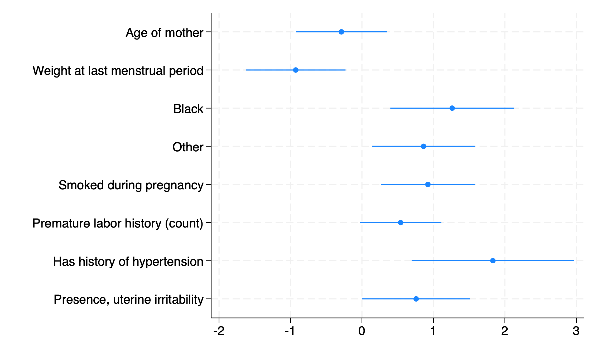
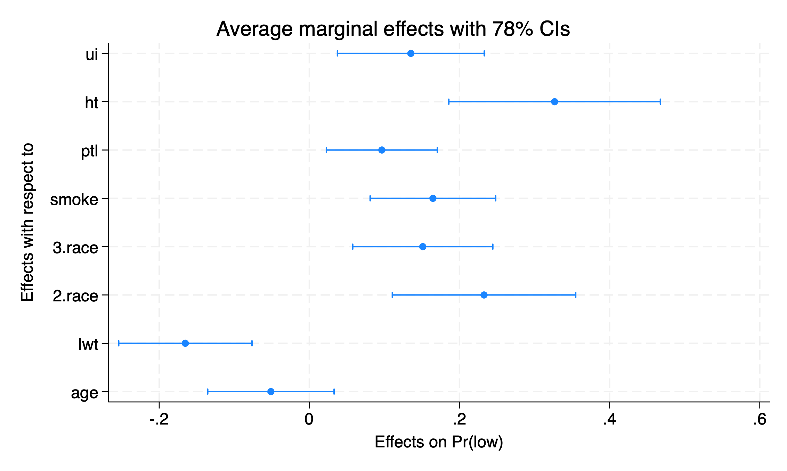

Here, we detail some of the uses of the `viztest` package in Stata.  This package helps you find the optimal confidence level for visual testing and is based on our paper.  You can install the package as follows:


```stata
net install viztest, 
  from("https://raw.githubusercontent.com/davidaarmstrong/viztest_stata/main/")
```


Here's an example using a logistic regression model.  First, we can grab the example data from the web and then run a logistic regression.  


```stata
webuse lbw
sum age
replace age = (age - `r(mean)')/(2*`r(sd)')
sum lwt
replace lwt = (lwt - `r(mean)')/(2*`r(sd)')
logit low age lwt i.race smoke ptl ht ui
```

```
(Hosmer & Lemeshow data)

    Variable |        Obs        Mean    Std. dev.       Min        Max
-------------+---------------------------------------------------------
         age |        189     23.2381    5.298678         14         45

variable age was byte now float
(189 real changes made)

    Variable |        Obs        Mean    Std. dev.       Min        Max
-------------+---------------------------------------------------------
         lwt |        189    129.8201    30.57515         80        250

variable lwt was int now float
(189 real changes made)


Iteration 0:  Log likelihood =   -117.336  
Iteration 1:  Log likelihood = -101.28644  
Iteration 2:  Log likelihood = -100.72617  
Iteration 3:  Log likelihood =   -100.724  
Iteration 4:  Log likelihood =   -100.724  

Logistic regression                                     Number of obs =    189
                                                        LR chi2(8)    =  33.22
                                                        Prob > chi2   = 0.0001
Log likelihood = -100.724                               Pseudo R2     = 0.1416

------------------------------------------------------------------------------
         low | Coefficient  Std. err.      z    P>|z|     [95% conf. interval]
-------------+----------------------------------------------------------------
         age |  -.2871916   .3862781    -0.74   0.457    -1.044283    .4698996
         lwt |  -.9264771   .4235196    -2.19   0.029     -1.75656    -.096394
             |
        race |
      Black  |   1.262647   .5264101     2.40   0.016     .2309024    2.294392
      Other  |   .8620792   .4391532     1.96   0.050     .0013548    1.722804
             |
       smoke |   .9233448   .4008266     2.30   0.021      .137739    1.708951
         ptl |   .5418366    .346249     1.56   0.118     -.136799    1.220472
          ht |   1.832518   .6916292     2.65   0.008     .4769494    3.188086
          ui |   .7585135   .4593768     1.65   0.099    -.1418484    1.658875
       _cons |  -2.135417   .4020014    -5.31   0.000    -2.923325   -1.347508
------------------------------------------------------------------------------
```

The `viztest` function finds the optimal confidence level that permits visual testing: 


```stata
viztest, lev1(.25) lev2(.99) incr(.01) a(.05) inc0 remc
```

```
Optimal Levels: 
 
     Conf. Level     Pr(Same)     Easiness
r51          .75    .88888889    6.8819594
r52          .76    .88888889    6.9135418
r53          .77    .88888889     6.946074
r54          .78    .88888889    7.0065985
r66           .9    .88888889    7.1567234
 
Missed Tests (n=5 of 45)
 
                     1                 2                 3                 4
    +-------------------------------------------------------------------------+
  1 |           LARGER           SMALLER           PW TEST           CI TEST  |
  2 |           ------           -------           -------           -------  |
  3 |            lowht            lowptl       Significant       Overlapping  |
  4 |         lowsmoke            lowage       Significant       Overlapping  |
  5 |         low3race            lowage       Significant       Overlapping  |
  6 |            lowui            lowage       Significant       Overlapping  |
  7 |        low1brace              zero     Insignificant   Not overlapping  |
    +-------------------------------------------------------------------------+
```

The result would suggest that if we wanted to make a coefficient plot, we should do so at the $90%$ level. 


```stata
coefplot, level(90) drop(_cons) 
```




Specifying the `inc0` option allows us to add the univariate tests against zero to consideration.  The `remc` option removes the constant from consideration in the pairwise tests.  We cal also use this with `margins`: 


```stata
quietly margins, dydx(*)
viztest, lev1(.25) lev2(.99) incr(.01) a(.05) inc0 remc usemargins
```

```
Optimal Levels: 
 
     Conf. Level     Pr(Same)     Easiness
r51          .75    .93333333    1.3533835
r52          .76    .93333333    1.3620144
r53          .77    .93333333    1.3685441
r54          .78    .93333333    1.3752807
 
Missed Tests (n=3 of 45)
 
                     1                 2                 3                 4
    +-------------------------------------------------------------------------+
  1 |           LARGER           SMALLER           PW TEST           CI TEST  |
  2 |           ------           -------           -------           -------  |
  3 |              ptl            1brace     Insignificant   Not overlapping  |
  4 |              ptl              zero     Insignificant   Not overlapping  |
  5 |           1brace              zero     Insignificant   Not overlapping  |
    +-------------------------------------------------------------------------+
```


```stata
margins, dydx(*)
marginsplot, level(78) recast(scatter) flip
```


