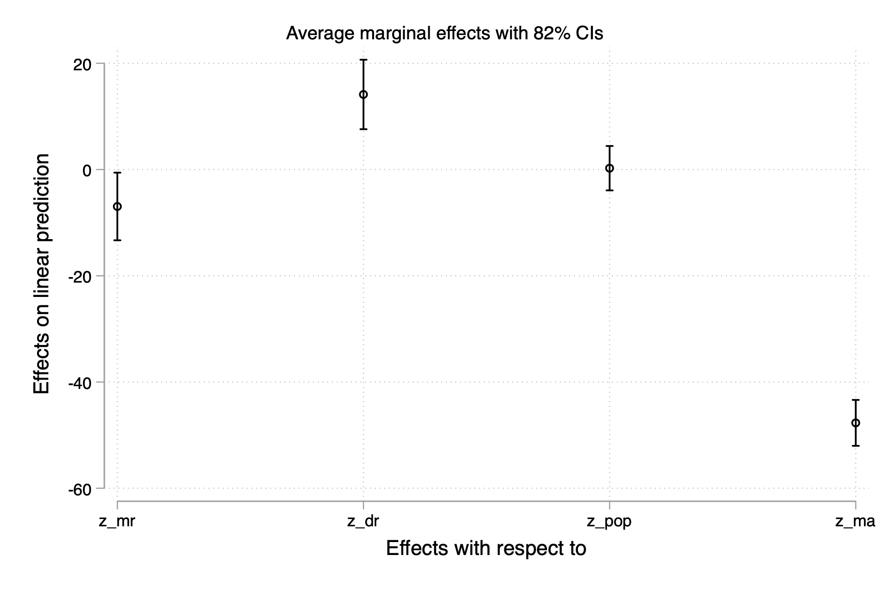
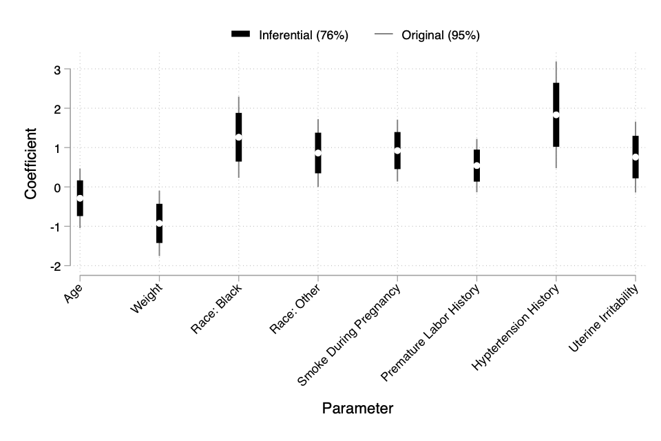
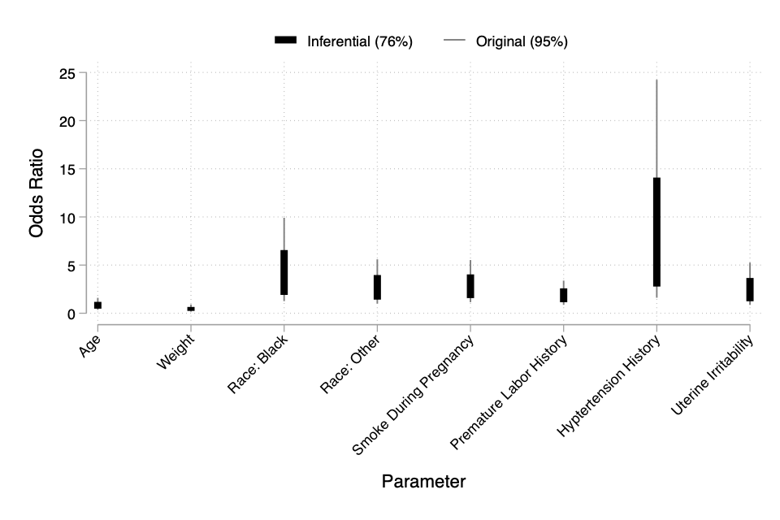
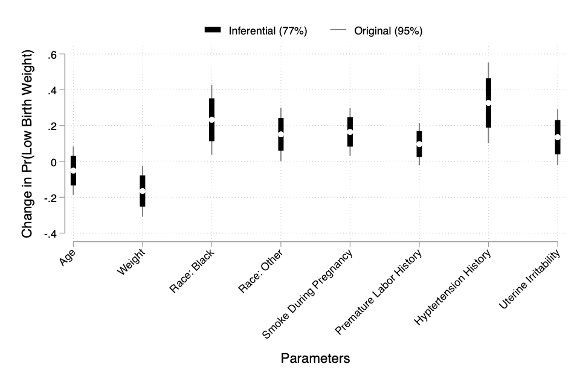

## Introduction

Here, we detail some of the uses of the `viztest` package in Stata.  This package helps you find the optimal confidence level for visual testing and is based on our paper.  You can install the package as follows:

```stata
net install viztest, from("https://raw.githubusercontent.com/davidaarmstrong/viztest_stata/main/")
```

The `viztest` package interfaces with output from both modeling functions and `margins`.   The simplest way to use `viztest` is to estimate a model and then run the function.  Consider an example using the `census13` data. We can use Andrew Gelman's idea of standardizing these variables by two standard deviations. 

## Regression Example

```
webuse census13, clear
egen z_mr = std(mrgrate), sd(.5)
egen z_dr = std(dvcrate), sd(.5)
egen z_ma = std(medage), sd(.5)
egen z_pop = std(pop), sd(.5)
```

Next, we can estimate the regression of birth rate (`brate`) on the standardized variables. 

``` 
reg brate z_mr z_dr z_pop c.z_ma##c.z_ma

      Source |       SS           df       MS      Number of obs   =        50
-------------+----------------------------------   F(5, 44)        =     75.80
       Model |  37807.3612         5  7561.47224   Prob > F        =    0.0000
    Residual |  4389.45878        44  99.7604268   R-squared       =    0.8960
-------------+----------------------------------   Adj R-squared   =    0.8842
       Total |    42196.82        49  861.159592   Root MSE        =     9.988

-------------------------------------------------------------------------------
        brate | Coefficient  Std. err.      t    P>|t|     [95% conf. interval]
--------------+----------------------------------------------------------------
         z_mr |  -6.954256   4.676084    -1.49   0.144    -16.37828    2.469773
         z_dr |   14.13249   4.798832     2.94   0.005     4.461081     23.8039
        z_pop |   .2499421   3.067509     0.08   0.935    -5.932215    6.432099
         z_ma |  -47.69396   3.171616   -15.04   0.000    -54.08593   -41.30199
              |
c.z_ma#c.z_ma |   17.26094   2.927897     5.90   0.000     11.36015    23.16172
              |
        _cons |   163.7111   1.584228   103.34   0.000     160.5183    166.9039
-------------------------------------------------------------------------------
```

The point of our paper is that there are potentially some confidence intervals in the output such that whether they overlap 
does not correspond with whether there is a significant difference between the two estimates. For example looking at the estimates s
for `z_dr` and `z_pop`.  Their confidence intervals overlap, but are they statistically different from each other?  We cannot answer
that question without doing the appropriate test: 

```
test z_dr = z_pop

 ( 1)  z_dr - z_pop = 0

       F(  1,    44) =    6.22
            Prob > F =    0.0165
```

Here, we see that there is a significant difference.  We could then ask `viztest` to provide the appropriate confidence level such that the 
overlaps (or lack thereof) represent the significance of the difference between estimates. 

```
viztest, inc0
 
Optimal Levels: 
 
Smallest Level: .65
Middle Level: .77
Largest Level: .91
Easiest Level: .82
 
No missed tests!
```

The output here shows us that any confidence level between 65% and 91% will correspond with the pairwise tests, but that the one that 
will make these differences easiest to apprehend visually is the 82% level.  One way we could use this information is to simply print 
the regerssion output with 82% confidence intervals. 

```
reg brate z_mr z_dr z_pop c.z_ma##c.z_ma, level(82)

      Source |       SS           df       MS      Number of obs   =        50
-------------+----------------------------------   F(5, 44)        =     75.80
       Model |  37807.3612         5  7561.47224   Prob > F        =    0.0000
    Residual |  4389.45878        44  99.7604268   R-squared       =    0.8960
-------------+----------------------------------   Adj R-squared   =    0.8842
       Total |    42196.82        49  861.159592   Root MSE        =     9.988

-------------------------------------------------------------------------------
        brate | Coefficient  Std. err.      t    P>|t|     [82% conf. interval]
--------------+----------------------------------------------------------------
         z_mr |  -6.954256   4.676084    -1.49   0.144    -13.32503   -.5834802
         z_dr |   14.13249   4.798832     2.94   0.005     7.594482     20.6705
        z_pop |   .2499421   3.067509     0.08   0.935    -3.929283    4.429167
         z_ma |  -47.69396   3.171616   -15.04   0.000    -52.01502    -43.3729
              |
c.z_ma#c.z_ma |   17.26094   2.927897     5.90   0.000     13.27192    21.24995
              |
        _cons |   163.7111   1.584228   103.34   0.000     161.5527    165.8694
-------------------------------------------------------------------------------
```

In the output above, you can see now that the intervals for `z_dr` and `z_pop` do not overlap.   Some reviewers may complain that 
"These intervals are too narrow".  If we were using the intervals themselves to do the testing, that may be true.  However, we 
are doing the appropriate tests at the 95% level and are simply using 82% intervals to capture the relevant differences (or lack thereof)
based on these 95% tests.  By decoupling the testing from the calculation of the confidence intervals, as long as their overlaps correspond
with the test results (as they do in this case), they cannot be _too_ narrow because the goal of the intervals here is to allow 
pairwise testing of the coefficients, which is what they do.  

### Viztest on the marginal effects

In the output above, we are probably making some comparisons that are not meaningful.  Since median age (`z_ma`) is represented with a 
quadratic polynomial, we should probably not be testing each coefficient in the polynomial term agains everything else.  Instead, we should
test something like the average marginal effect (i.e., the average first derivative of the term with respect to the outcome).  We can 
also do this by calculating the marginal effects with `margins` and then calling `viztest` on the result. 

```
margins, dydx(*) 

Average marginal effects                                    Number of obs = 50
Model VCE: OLS

Expression: Linear prediction, predict()
dy/dx wrt:  z_mr z_dr z_pop z_ma

------------------------------------------------------------------------------
             |            Delta-method
             |      dy/dx   std. err.      t    P>|t|     [95% conf. interval]
-------------+----------------------------------------------------------------
        z_mr |  -6.954256   4.676084    -1.49   0.144    -16.37828    2.469773
        z_dr |   14.13249   4.798832     2.94   0.005     4.461081     23.8039
       z_pop |   .2499421   3.067509     0.08   0.935    -5.932215    6.432099
        z_ma |  -47.69396   3.171616   -15.04   0.000    -54.08593   -41.30199
------------------------------------------------------------------------------
```

To use `viztest`, we need to make sure to use the `usemargins` argument: 

```
viztest, inc0 usemargins
 
Optimal Levels: 
 
Smallest Level: .65
Middle Level: .77
Largest Level: .91
Easiest Level: .82
 
No missed tests!
```

As it turns out, the results are the same here.  You could use this by making the marginsplot using the prescribed 82% confidence 
intervals. 

```
marginsplot, level(82) recast(scatter)
```



Working from here, I am sure you can make a graph that suits your needs.  


## Logistic Regression

In the linear regression model, the marginal effects (i.e., the partial first derivatives) are often the same as the coefficients themselves, 
though this wasn't the case above where we used a quadratic polynomial.  In non-linear GLMs, like the logistic regression model, this is not the case. 
The marginal effects depend on the functional form of the error distribution and all other parameter estimates/variables in the model.  To 
demonstrate how `viztest` works in this situation, consider the following example. 

First, we can grab some example data from the web and then run a logistic regression.  


```stata
webuse lbw
egen z_age = std(age), sd(.5)
egen z_lwt = std(lwt), sd(.5)
logit low z_age z_lwt i.race smoke ptl ht ui, nolog

Logistic regression                                     Number of obs =    189
                                                        LR chi2(8)    =  33.22
                                                        Prob > chi2   = 0.0001
Log likelihood = -100.724                               Pseudo R2     = 0.1416

------------------------------------------------------------------------------
         low | Coefficient  Std. err.      z    P>|z|     [95% conf. interval]
-------------+----------------------------------------------------------------
       z_age |  -.2871916   .3862781    -0.74   0.457    -1.044283    .4698996
       z_lwt |  -.9264771   .4235196    -2.19   0.029     -1.75656    -.096394
             |
        race |
      Black  |   1.262647   .5264101     2.40   0.016     .2309024    2.294392
      Other  |   .8620792   .4391532     1.96   0.050     .0013548    1.722804
             |
       smoke |   .9233448   .4008266     2.30   0.021      .137739    1.708951
         ptl |   .5418366    .346249     1.56   0.118     -.136799    1.220472
          ht |   1.832518   .6916292     2.65   0.008     .4769494    3.188086
          ui |   .7585135   .4593768     1.65   0.099    -.1418484    1.658875
       _cons |  -2.135417   .4020014    -5.31   0.000    -2.923325   -1.347508
------------------------------------------------------------------------------
```

### Plotting the Coefficients

We could use `viztest` to find the optimal confidence level for visual comparison of the model parameters themselves.  


```stata
viztest, lev1(.25) lev2(.99) incr(.01) a(.05) inc0 remc
 
Optimal Levels: 
 
Smallest Level: .75
Middle Level: .76
Largest Level: .78
Easiest Level: .76
 
 
Missed Tests (n=2 of 36)
 
                     1                 2                 3                 4
    +-------------------------------------------------------------------------+
  1 |           LARGER           SMALLER           PW TEST           CI TEST  |
  2 |           ------           -------           -------           -------  |
  3 |            lowui              zero     Insignificant   Not overlapping  |
  4 |           lowptl              zero     Insignificant   Not overlapping  |
    +-------------------------------------------------------------------------+
```

In the example above, we see that any level between 75% and 78% would work, but the 76% confidence intervals will make it easiest to 
apprehend the differences visually.  Further, we see that of the 36 pairwise tests (8 coefficients plus 0, where with $m$ stimuli, 
the number of pairwise comparisons is $\frac{m(m-1)}{2}$), we get two of the pairwise tests wrong - the tests of `lowui` and `lowptl` against zero. 
Otherwise, the (lack of)difference is perfectly represented by the 76% confidence intervals. 

There are a couple of different ways to deal with this issue.  First, would be to simply present the 76% confidence intervals and in the 
note to the table or figure, identify the places where the confidence interval (non-)overlaps are not consistent the pairwise tests.  In this 
case, A) the tests that are missed are really univariate tests relative to zero and B) we know that the 95% confidence intervals operationalize
the two-tailed test against a point null (like zero). Since both of those are true, you could also print the 95% intervals that would appropriately
capture all the tests against zero while also printing the 76% intervals that would capture all pairwise tests. 

Plotting both intervals is a bit trickier.  The reason is that you need to save both results in an easy-to-plot format.  There may be other, more 
efficient ways of doing this, but this one works. 

```
* Return original logit results
quietly logit
* save the results table and keep the estimate and the
* confidence bounds
mat tabo = r(table)'
mat tabo = tabo[....,1], tabo[....,5], tabo[....,6]

* margins with 76% confidence intervals
quietly logit, level(76)

* keep the lower and upper bounds from the estimates table
mat tabi = r(table)'
mat tabi = tabi[....,5], tabi[....,6]

* put the results together in a matrix
mat out = tabo, tabi

* create a new frame and change to the frame
frame create res
frame change res

* place matrix results in the new frame
svmat out, names(out)

* rename all the variables
rename out1 estimate
rename out2 lwr95
rename out3 upr95
rename out4 lwr76
rename out5 upr76
drop if lwr95 == .

* generate a variable for the x-axis
gen obs = _n
quietly des
drop in `r(N)'

* make the graph
twoway  (rcapsym lwr95 upr95 obs, lwidth(medium) msymbol(none) lcolor(gs8)) || ///
    (rcapsym lwr76 upr76 obs, lwidth(vthick) msymbol(none) lcolor(black)) || /// 
    (scatter estimate obs, mcolor(white) mfcolor(white) msymbol(circle)), ///
    xlabel(1 "Age" 2 "Weight" 3 "Race: Black" 4 "Race: Other" 5 "Smoke During Pregnancy" 6 "Premature Labor History" 7 "Hyptertension History" 8 "Uterine Irritability", angle(45)) ///
    legend(order(2 "Inferential (76%)" 1 "Original (95%)") position(12) cols(2)) ///
    xtitle("Parameter") ytitle("Coefficient")

* change to the default frame and drop the one
* created for the figure
frame change default
frame drop res    
```




Assuming there are no terms in the model that would make odds ratios more difficult to calculate (e.g., polynomials), then this could easily be done with a transformation of the 
coefficients and an end-point transformation on the confidence intervals.  The results of `viztest` should still hold.  If confidence intervals overlap on the coefficient scale, they will
continue to overlap on the odds-ratio scale.  The converse is also true.  A transformation just before the plot would accomplish this: 

```
replace estimate = exp(estimate)
replace lwr95 = exp(lwr95)
replace upr95 = exp(upr95)
replace lwr76 = exp(lwr76)
replace upr76 = exp(upr76)	
	
twoway  (rcapsym lwr95 upr95 obs, lwidth(medium) msymbol(none) lcolor(gs8)) || ///
    (rcapsym lwr76 upr76 obs, lwidth(vthick) msymbol(none) lcolor(black)), ///
    xlabel(1 "Age" 2 "Weight" 3 "Race: Black" 4 "Race: Other" 5 "Smoke During Pregnancy" 6 "Premature Labor History" 7 "Hyptertension History" 8 "Uterine Irritability", angle(45)) ///
    legend(order(2 "Inferential (76%)" 1 "Original (95%)") position(12) cols(2)) ///
    xtitle("Parameter") ytitle("Odds Ratio")
```



### Viztest on Margins Result

If you would rather use `viztest` on the first derivatives (continuous variables) or first differences (categorical variables specified with the `i.` construct), you could do this as 
well by calling the appropriate `margins` command and then proceeding in a similar fashion as above.  First, we could estimate `viztest` on the results of `margins`.  

```
. margins, dydx(*)

Average marginal effects                                   Number of obs = 189
Model VCE: OIM

Expression: Pr(low), predict()
dy/dx wrt:  z_age z_lwt 2.race 3.race smoke ptl ht ui

------------------------------------------------------------------------------
             |            Delta-method
             |      dy/dx   std. err.      z    P>|z|     [95% conf. interval]
-------------+----------------------------------------------------------------
       z_age |  -.0512013   .0686149    -0.75   0.456    -.1856841    .0832815
       z_lwt |  -.1651749   .0723684    -2.28   0.022    -.3070144   -.0233354
             |
        race |
      Black  |   .2326941   .0995698     2.34   0.019     .0375409    .4278473
      Other  |   .1511004   .0760619     1.99   0.047     .0020217     .300179
             |
       smoke |   .1646164   .0681744     2.41   0.016     .0309971    .2982358
         ptl |   .0966001   .0602536     1.60   0.109    -.0214948    .2146951
          ht |   .3267063   .1148706     2.84   0.004     .1015641    .5518485
          ui |   .1352299   .0797297     1.70   0.090    -.0210375    .2914972
------------------------------------------------------------------------------
Note: dy/dx for factor levels is the discrete change from the base level.

. viztest, lev1(.25) lev2(.99) incr(.01) a(.05) inc0 usemargins
 
Optimal Levels: 
 
Smallest Level: .75
Middle Level: .76
Largest Level: .78
Easiest Level: .77
 
 
Missed Tests (n=1 of 36)
 
                     1                 2                 3                 4
    +-------------------------------------------------------------------------+
  1 |           LARGER           SMALLER           PW TEST           CI TEST  |
  2 |           ------           -------           -------           -------  |
  3 |              ptl              zero     Insignificant   Not overlapping  |
    +-------------------------------------------------------------------------+
```

The best confidence level to use here is 77% and in doing so, one test is missed - the pre-term labor history is not significantly different from zero, but it's 77% confidence interval 
does not overlap zero.  We could, then, also present the 95% intervals to capture this discrepancy.  

```
* calculate margins with default 95% confidence intervals
quietly margins, dydx(*) 

* save the results table and keep the estimate and the
* confidence bounds
mat tabo = r(table)'
mat tabo = tabo[....,1], tabo[....,5], tabo[....,6]

* margins with 76% confidence intervals
quietly margins, dydx(*) level(77)

* keep the lower and upper bounds from the estimates table
mat tabi = r(table)'
mat tabi = tabi[....,5], tabi[....,6]

* put the results together in a matrix
mat out = tabo, tabi

* create a new frame and change to the frame
frame create res
frame change res

* place matrix results in the new frame
svmat out, names(out)

* rename all the variables
rename out1 estimate
rename out2 lwr95
rename out3 upr95
rename out4 lwr77
rename out5 upr77
drop if lwr95 == .

* generate a variable for the x-axis
gen obs = _n

* make the graph
twoway  (rcapsym lwr95 upr95 obs, lwidth(medium) msymbol(none) lcolor(gs8)) || ///
    (rcapsym lwr77 upr77 obs, lwidth(vthick) msymbol(none) lcolor(black)) || /// 
    (scatter estimate obs, mcolor(white) mfcolor(white) msymbol(circle)), ///
    xlabel(1 "Age" 2 "Weight" 3 "Race: Black" 4 "Race: Other" 5 "Smoke During Pregnancy" 6 "Premature Labor History" 7 "Hyptertension History" 8 "Uterine Irritability", angle(45)) ///
    legend(order(2 "Inferential (77%)" 1 "Original (95%)") position(12) cols(2)) ///
    xtitle("Parameters") ytitle("Pr(Low Birth Weight)")

* change to the default frame and drop the one
* created for the figure
frame change default
frame drop res    
```



